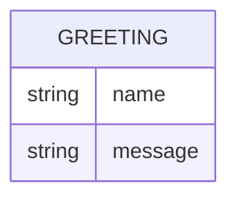

# Domain Model

The greeter service is stateless and persists nothing, but it still has one shape worth drawing: the greeting it returns.

`GREETING` is a response shape, not a stored record — `name` is the optional caller-supplied name, and `message` is the generated hello text returned to the caller.